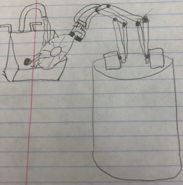

# Robot-Arm
## Goal
We will make a robot arm that can lift a plate from a surface. It will move it under a sink or running water. Once the plate has been rinsed off the arm will dump the water and set the plate in either the sink or on a nearby surface.
## Materials
1x Plate,
1x Arduino,
1x Switch,
3x Servos,
1x Battery Pack,
1x Bread Board,
Acrylic, 3D printed parts, Screws, Spacers, Wires.
## Schedule
| Date  | Milestone |
| ------------- | ------------- |
| 12/6  | Complete planning and mock assembly  |
| 12/13  | Verify dimentions, collect correct materials| 
| 12/20  | Create full assembly (Solidworks) Learn Proccessing with Arduino  |
| 12/27  | Start practice code, Laser cut and 3D print, and Assemble parts  |
| 1/3  | Make sure grabber / claw can pick up plate, edit code accordingly  |
| 1/10  | Make sure Assembly holds up and code runs smoothly (Fix Issues) |
| 1/17  | Have fully functional Assembly and Code for Robot Arm  |

## Design / Outline

